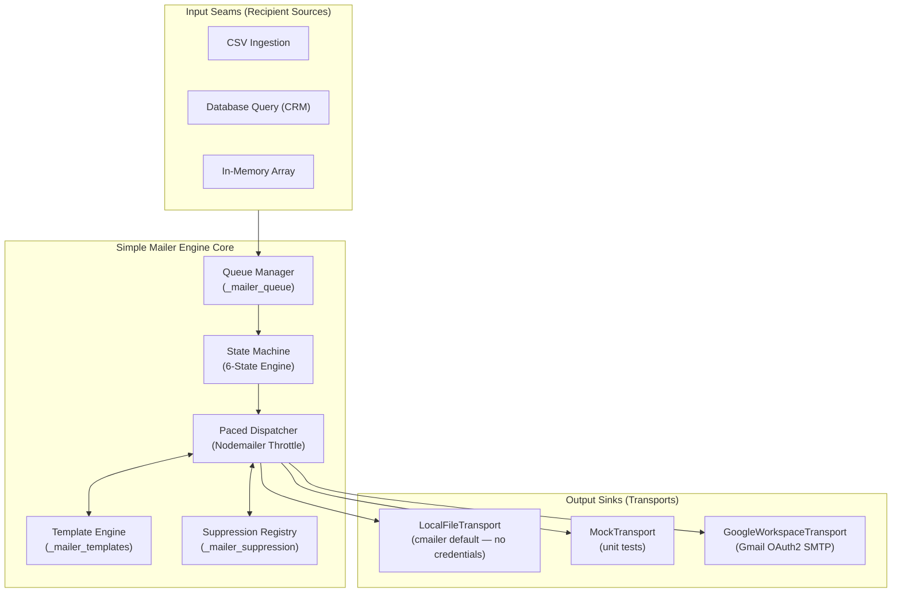
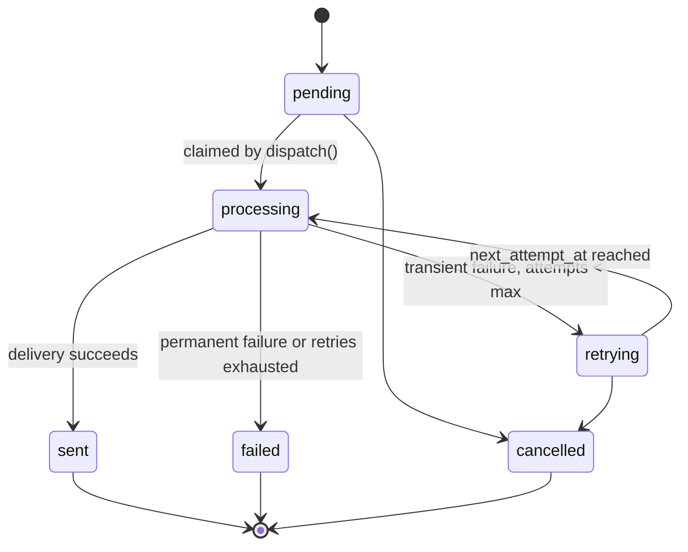

# Simple Mailer

[](https://github.com/cegaana/simple-mailer/actions/workflows/ci.yml)
[](https://www.typescriptlang.org/)
[](https://nodejs.org/)
[](./LICENSE)

Built and maintained by [CEGAANA](https://cegaana.org) for its own event and
alumni mailings, and open-sourced for anyone who needs the same thing.

This repo is two packages:

- **[`simple-mailer/`](./simple-mailer)** (`@cegaana/simple-mailer`) — a standalone, embeddable email template management and dispatch **library**. Built with Node.js, TypeScript, and SQLite (`better-sqlite3`). Reliable execution of bulk email campaigns, event communications, and transactional notifications with built-in rate pacing, exponential backoff, crash recovery, and a pluggable delivery **Transport** — `LocalFileTransport` (credential-free), `GoogleWorkspaceTransport` (real Gmail OAuth2 delivery), and an in-memory `MockTransport` for tests. It takes a database and a Transport as parameters — it does not choose either for you.
- **[`cmailer/`](./cmailer)** (`@cegaana/cmailer`, "CEGAANA mail CLI") — a command-line tool built on top of the library. It supplies the SQLite database, the email templates, and the Transport configuration, driving the mail experience with local file-based delivery by default and real CEGAANA Google Workspace sending when configured (`docs/setup-google-workspace.md`).

---

## 🚀 Key Features

- **Isolated Schema Management:** Operates exclusively within its own isolated tables prefixed with `_mailer_*`. Never modifies or depends on columns in host CRM databases.
- **Snapshot Coupling:** Enqueues frozen recipient snapshots (`email`, `name`, `metadata_json`). Host database mutations after enqueue never disrupt running campaigns.
- **Pluggable Delivery Transport:** `LocalFileTransport` (writes each message to an inspectable folder — the `cmailer` default, no credentials needed), `GoogleWorkspaceTransport` (real Gmail OAuth2 SMTP delivery via `nodemailer` — `docs/setup-google-workspace.md`), and `MockTransport` (in-memory, for tests) all share the same `EmailTransport` seam.
- **Offline Mock Testing:** First-class `MockTransport` intercepts outbound messages in-memory for 100% automated test coverage with zero real credentials or network calls.
- **Enforced Rate Pacing:** Configurable delay between sends (default: **2,500ms**) prevents provider throttling and domain bans.
- **Rate Limit Abort Handling:** Automatically pauses queue execution upon encountering provider quota limits (HTTP 429/550) and returns a structured dispatch report.
- **Comprehensive CLI Suite:** Standalone command-line binary (`cmailer`) for headless campaign creation, dry-run simulation, queue dispatch, live progress monitoring, and suppression list management — plus a one-shot `cmailer send` (template upsert + campaign + enqueue + dispatch + stats) for the common case.
- **Template Engine & Modular Signatures:** Multi-format (HTML + text) interpolation with variable fallbacks (`{{ first_name | default('Friend') }}`), HTML entity escaping, and reusable signatures (`{{ signature }}`).
- **Global Suppression & Opt-Outs:** Automatic suppression filtering for unsubscribes, bounces, and complaints.

---

## 🚀 Getting Started

This repository is a small npm-workspaces monorepo: the documentation and this
README live at the root, the library lives in
**[`simple-mailer/`](./simple-mailer)**, and the CLI lives in
**[`cmailer/`](./cmailer)**. You run the CLI — the `cmailer` command — from the
**root** folder. (`npm run dev` inside `cmailer/` is only a development
convenience; you do not need it.)

**Requirements:** Node.js >= 24.

### Install & build

From the repository root:

```bash
npm install
```

Installing at the root also builds both workspaces (npm workspaces runs the
library's `prepare` script, and `cmailer` depends on its build output), so the
CLI is ready immediately. Rebuild later with `npm run build`.

### Run the CLI from the root folder

Any of these run the same CLI from the root:

```bash
npx cmailer --help                # after `npm install` at the root
npm run cmailer -- --help         # convenience script, needs only a build
node cmailer/dist/cli.js --help   # the entry point, directly
```

For a permanent `cmailer` command in your shell (optional; installs it on
your machine): run `npm link` inside the `cmailer/` folder.

### Help & version

Every command supports `--help`, and each command group has its own detailed
help page:

```bash
cmailer --help              # overview of all commands
cmailer campaign --help     # focused help for one command
cmailer help template       # same as: template --help
cmailer --version           # or -v
```

> **New here?** The **[CLI Testing Guide](docs/cli-testing-guide.md)** walks
> through every feature in sequence, with copy-pasteable commands and expected
> output.

---

## 🏛️ System Architecture



---

## 📂 Repository Structure

```
simple-mailer/                     # repository root — run the CLI from here
├── README.md
├── package.json                   # workspace root (workspaces: simple-mailer, cmailer)
├── LICENSE                        # MIT
├── .env.example                   # MAILER_GOOGLE_* — copy to .env.local, see setup-google-workspace.md
├── docs/                          # design docs, guides, PRDs
│   ├── cli-testing-guide.md       # step-by-step CLI feature test (start here)
│   ├── cli-walkthrough-local-file.md
│   ├── cli-walkthrough-google-workspace.md
│   ├── setup-google-workspace.md
│   ├── status-and-usage.md
│   └── ...
├── simple-mailer/                 # the library (@cegaana/simple-mailer)
│   ├── src/                       # engine, provider, template engine, transports
│   ├── schema/mailer-schema.sql   # canonical SQLite DDL (copied into dist/ at build time)
│   ├── tests/                     # vitest suites
│   ├── dist/                      # compiled output (generated)
│   └── package.json
└── cmailer/                       # the CLI (@cegaana/cmailer), depends on simple-mailer
    ├── src/
    │   ├── cli.ts                 # entrypoint: parseArgs, command routing
    │   ├── commands/               # one module per command group (campaign, template, suppression, dispatch, send)
    │   ├── transport.ts            # --transport / --google-* → concrete Transport
    │   ├── env.ts                  # .env / .env.local loader
    │   └── flags.ts, csv.ts, table.ts, version.ts, help.ts
    ├── tests/                     # vitest suites
    ├── dist/                      # compiled output (generated)
    └── package.json
```

---

## 📊 Database Schema (`simple-mailer/schema/mailer-schema.sql`)

All internal tables are isolated with the `_mailer_` prefix:

| Table Name | Primary Key | Description |
| :--- | :--- | :--- |
| **`_mailer_campaigns`** | `id` (`TEXT`) | Campaign entity storing subject, templates, status (`draft`, `scheduled`, `running`, `paused`, `completed`), and schedules. |
| **`_mailer_templates`** | `id` (`TEXT`) | Multi-format message templates with HTML, plain text, and sample data. |
| **`_mailer_signatures`**| `id` (`TEXT`) | Reusable sender signatures embedded dynamically via `{{ signature }}`. |
| **`_mailer_queue`** | `id` (`TEXT`) | Individual delivery jobs, atomic state columns (`status`, `attempts`, `locked_at`, `next_attempt_at`), and merge JSON. |
| **`_mailer_suppression`** | `email` (`TEXT`) | Global opt-out, hard bounce, and unsubscribe registry. |
| **`_mailer_logs`** | `id` (`TEXT`) | Granular delivery audit log with provider message IDs, latency, and errors. |

### Queue job lifecycle (`_mailer_queue.status`)



`processing` jobs whose lease (`locked_at`) expires without a terminal state
are reclaimed back to `retrying` by the lease sweeper — see decision 22 in
[`build-roadmap.md`](docs/build-roadmap.md).

---

## 💻 Programmatic TypeScript API

### Initializing the Engine

A template must exist before a campaign can reference it — see
`MailerDataProvider.upsertTemplate` / `cmailer template create`. Bodies are
referenced by `templateId`, not passed inline (see "Design decisions" in
[`docs/build-roadmap.md`](docs/build-roadmap.md)).

```ts
import Database from 'better-sqlite3';
import { MailerEngine, SqliteProvider, MockTransport, initSchema } from '@cegaana/simple-mailer';

const db = new Database('./data/app.db');
initSchema(db);

const mailer = new MailerEngine(new SqliteProvider(db), {
    transport: new MockTransport().send,   // swap for LocalFileTransport or GoogleWorkspaceTransport to send for real
    delayMs: 2500,     // 2.5 seconds between sends
    maxRetries: 2,      // 3 attempts total per recipient
    batchLimit: 1000
});
```

### Creating & Dispatching a Campaign

```ts
// 1. Create a Campaign (templateId references an existing template — see above)
const campaignId = await mailer.createCampaign({
    name: 'Alumni Meet 2026 - Speaker Briefing',
    subject: 'Important Briefing for Speakers — {{ first_name }}',
    templateId: 'speaker-invite',
});

// 2. Enqueue Recipients Snapshot
const { queuedCount, duplicateCount, suppressedCount } = await mailer.enqueueRecipients(campaignId, [
    {
        email: 'jane@example.com',
        name: 'Jane Doe',
        metadata: { first_name: 'Jane', event_name: 'CEGAANA Fall Event' }
    },
    {
        email: 'charlie@example.com',
        name: 'Charlie Brown',
        metadata: { first_name: 'Charlie', event_name: 'CEGAANA Fall Event' }
    }
]);

// 3. Dispatch Campaign with Progress Monitoring
const report = await mailer.dispatch(campaignId, {
    delayMs: 2500,
    onProgress: (progress) => {
        console.log(`[${progress.percent}%] ${progress.status} ${progress.email} (${progress.completedCount}/${progress.totalCount})`);
    }
});

console.log(`Dispatch completed in ${report.durationMs}ms:`, report);
```

### Inspecting a Template

`inspectVariables()` lists a template's placeholders and marks which ones
have a `| default(...)` fallback. `cmailer template check` and `send`'s
preflight check both use it to compare a template's required placeholders
against a CSV's columns before any campaign exists.

```ts
import { inspectVariables } from '@cegaana/simple-mailer';

const template = await engine.getTemplate('speaker-invite'); // by id or slug; null if not found

const vars = inspectVariables(template.subject, template.bodyHtml, template.bodyText);
// [{ name: 'event_name', hasDefault: false, defaultValue: undefined },
//  { name: 'first_name', hasDefault: true, defaultValue: 'there' }]
```

---

## ⌨️ CLI Commands

```bash
# Campaign Management
cmailer campaign create --name "Speaker Briefing" --subject "Briefing for {{ first_name }}" --template speaker-invite
cmailer campaign enqueue <campaign-id> --csv ./recipients.csv
cmailer campaign list                     # list campaigns with status and MODE (dry-run vs live)
cmailer campaign list --stats             # tabular overview of delivery stats for all campaigns
cmailer campaign stats                    # tabular overview of all campaigns (one row per campaign)
cmailer campaign stats <campaign-id>      # detailed delivery statistics for a campaign (JSON)

# Dispatch — writes to ./data/outbox/ by default (LocalFileTransport, no credentials needed)
cmailer dispatch <campaign-id>
cmailer dispatch <campaign-id> --delay 2500 --limit 100
cmailer dispatch <campaign-id> --out-dir ./data/my-outbox
cmailer dispatch <campaign-id> --transport google-workspace   # real Gmail send — see docs/setup-google-workspace.md
cmailer dispatch <campaign-id> --dry-run   # routes through MockTransport instead; nothing written

# Send — create + enqueue + dispatch + stats in one command
cmailer send --name "Speaker Briefing" --subject "Briefing for {{ first_name }}" \
  --template speaker-invite --html ./body.html --text ./body.txt --csv ./recipients.csv
# or drive directly from a central JSON manifest (resolves slug, subject, name, and body files):
cmailer send --config ./templates/tickets.json --preset single --csv ./recipients.csv --dry-run

# Template Studio
cmailer template create --slug speaker-invite --name "Speaker invite" --subject "..." --html ./body.html --text ./body.txt
cmailer template upsert --slug speaker-invite --name "Speaker invite" --subject "..." --html ./body.html --text ./body.txt
cmailer template check --config ./templates/tickets.json --preset single --csv ./recipients.csv  # preflight check
cmailer template list
cmailer template preview event-speaker-invite --data '{"first_name":"Jane"}'

# Suppression & Opt-Outs
cmailer suppression add user@example.com --reason "unsubscribed"
cmailer suppression list
cmailer suppression stats   # counts, total and by reason
```

### Manifest-Driven Campaigns & Preflight Validation

`cmailer` supports driving email dispatches from a central JSON manifest (e.g. `tickets.json` or `campaigns.json`):

```json
{
  "single": {
    "name": "ORG Fall Event 2026 - Single Ticket",
    "slug": "fall-event-2026-single",
    "subject": "ORG Fall Event 2026: Single Ticket Registration Confirmed!",
    "html": "ticket_single.html",
    "text": "ticket_single.txt"
  }
}
```

* **One-shot send with preset:**  
  `cmailer send --config ./templates/tickets.json --preset single --csv ./recipients.csv --dry-run`
* **Preflight validation against CSV:**  
  `cmailer template check --config ./templates/tickets.json --preset single --csv ./recipients.csv`  
  Checks that all required `{{ placeholders }}` (without default values) exist in the CSV headers before any campaign is created.
* **Strict mode:**  
  Add `--strict` to `cmailer send` to abort immediately if CSV columns are missing required placeholders.

---

## 🧪 Testing & Verification

Each package's automated suite lives in its own `tests/` (`simple-mailer/tests/`,
`cmailer/tests/`). Run them from the repository root:

```bash
npm test          # all unit + mock-integration tests (vitest), both workspaces
npm run typecheck # type-check without emitting, both workspaces
npm run lint      # static analysis (eslint), both workspaces
```

---

## 📄 Documentation Links

> **Start here.** Parts of this README describe the intended v2 surface rather
> than what is built. The documents at the top of this list, up through
> "Build Roadmap," are current.

- **[CLI Testing Guide](docs/cli-testing-guide.md)** — step-by-step test of
  every CLI feature, from the root folder, with expected output
- **[Local-File CLI Walkthrough](docs/cli-walkthrough-local-file.md)** —
  copy-pasteable tour of every working feature, no credentials needed
- **[Google Workspace CLI Walkthrough](docs/cli-walkthrough-google-workspace.md)**
  — the same tour, sending through a real CEGAANA Gmail account
- **[Google Workspace Setup](docs/setup-google-workspace.md)** — one-time
  OAuth2 client + refresh token setup for the walkthrough above
- **[Status & Usage](docs/status-and-usage.md)** — what is done, what is not,
  how to run and test it
- **[Build Roadmap](docs/build-roadmap.md)** — phases, gates and the decision log
- **[Conceptual Design & State Machine](docs/mail-subsystem-draft2.md)** —
  the reconciled design; source of truth for the state machine and schema
- **[PRD — Standalone Mailer Subsystem](docs/prd-mailer-subsystem.md)** *(v2 surface)*
- **[PRD — Mail Template Definition & Management](docs/prd-mail-templates.md)** *(v2 surface)*
- **[Canonical SQLite DDL Schema](simple-mailer/schema/mailer-schema.sql)**

---

## 📜 License

[MIT License](./LICENSE) — Copyright (c) 2026 [CEGAANA Engineering](https://cegaana.org).
