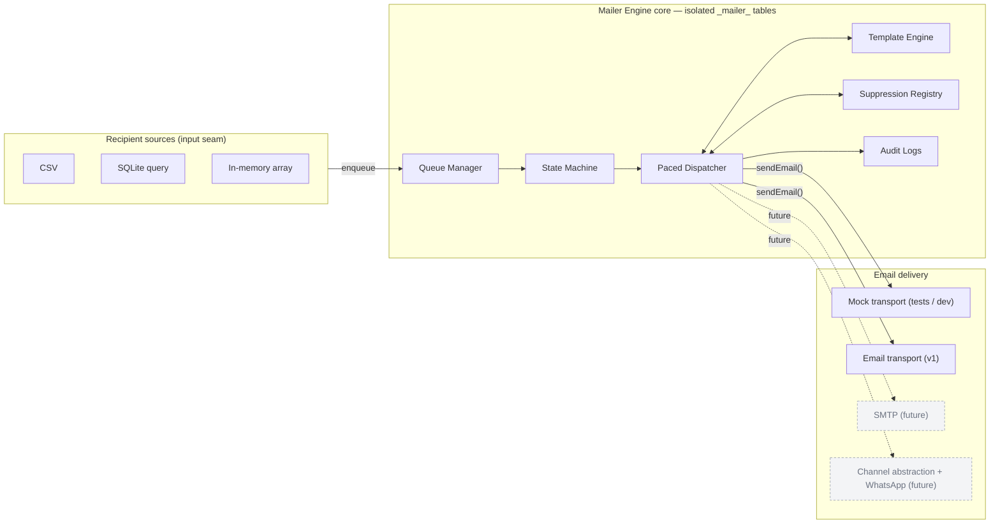
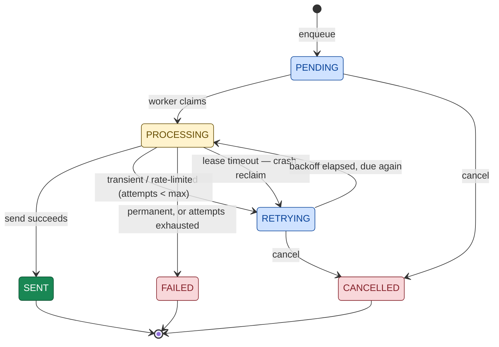
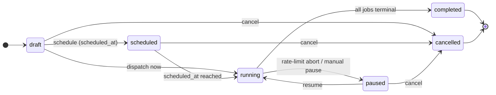

# Mailer Engine — Design Document (v2)
 
> Status: **v2 design.**
> This version merges our phased design work with the `simple-mailer` repo's
> canonical schema and PRDs. Sections marked _Deferred_ are intentionally out of v1 scope.
> Naming follows the repo's canonical `schema/mailer-schema.sql` so the design and the
> DDL stay in lockstep.
 
---
 
## 1. Overview & Goals
 
The Mailer Engine is a **self-contained, embeddable email queue and dispatch engine**
(Node.js + TypeScript + `better-sqlite3`). It reliably delivers bulk email campaigns and
event communications with rate pacing, exponential backoff, crash recovery, suppression
handling, audit logging, and offline mock testing. CLI-first; also usable as a programmatic
library.
 
**Motivating use case:** emailing registrants of an event (e.g. an alumni meet). A source
of recipients hands the engine a batch; the engine delivers to each one and tracks the
outcome.
 
**Design principles**
- Correctness over scalability (single machine, single worker for v1).
- MVP first; leave clean seams, build only what v1 needs.
- The engine owns its state in isolated `_mailer_*` tables; it never reads or mutates host
  CRM tables.
**v1 focus: email only.** The generic multi-channel abstraction (and WhatsApp) is
deferred. To keep that future cheap, all delivery goes through a single `sendEmail()`
boundary that returns a **generic outcome** — see §7.
 
---
 
## 2. Architecture
 

 
_Dashed = deferred. All storage access goes through a thin `MailerDataProvider` interface
(§10); the `better-sqlite3` implementation is the v1 backend._
 
---
 
## 3. CRM ↔ Mailer Coupling — Snapshot Model
 
The engine **receives** recipients; it does not read them live. At enqueue time the source
produces a self-contained payload and the engine **copies** each recipient into
`_mailer_queue`, never reading the source's tables again. A campaign is therefore a *frozen
snapshot*: source edits after enqueue do not disturb a running campaign. Corrections happen
through explicit engine operations on the queue (see §8 mutation rule) and through the
suppression list (§9) — never through live coupling.
 
---
 
## 4. Boundary Payload — The Contract
 
The source sends **intent and data only**; it never sets engine-owned state (`status`,
`attempts`, timestamps).
 
**Campaign-level**
- `name` — human label, e.g. `"Alumni Meet 2026"`.
- `subject` — subject line (may contain placeholders).
- `template_id` — the template to render (referenced; see §6).
- `scheduled_at` — optional; "do not send before this time."
- _(No `channel` column in v1 — email is implied. Added when the channel abstraction lands.)_
**Recipient-level** (`RecipientInput`)
- `email` — destination address.
- `name` — optional display name.
- `metadata` — per-person merge variables, stored as `metadata_json`
  (e.g. `{ first_name, event_name, tier }`).
- `id` — optional loose reference to an external CRM contact (`recipient_id`), for tracing only.
---
 
## 5. Canonical Schema (Phase 3)
 
v1 builds these tables (names/columns per `schema/mailer-schema.sql`). Tables prefixed
`_mailer_`.
 
**`_mailer_campaigns`** — `id` (PK), `name`, `subject`, `template_id`,
`template_text`/`template_html` _(reserved for deferred inline templates — unused in v1)_,
`status` (campaign lifecycle, §11), `scheduled_at`, `created_at`, `updated_at`.
 
**`_mailer_templates`** — `id` (PK), `slug` (UNIQUE), `name`, `description`, `subject`,
`body_html`, `body_text`, `signature_id` _(deferred feature — nullable)_, `sample_data_json`,
timestamps.
 
**`_mailer_queue`** — `id` (PK), `campaign_id` (FK → campaigns, `ON DELETE CASCADE`),
`recipient_id` (optional), `email`, `name`, `metadata_json`, `status` (job state, §8),
`attempts`, `max_attempts` (default 3), `locked_at` (lease), `next_attempt_at`,
`error_message`, `provider_message_id`, `sent_at`, timestamps.
Constraint: **`UNIQUE(campaign_id, email)`** (idempotency guard against duplicate sends).
Indexes: claim index on `(status, next_attempt_at) WHERE status IN ('pending','retrying')`;
`(campaign_id, status)`; `(email)`.
 
**`_mailer_suppression`** — `email` (PK), `reason` (`unsubscribe|hard_bounce|spam_complaint|manual`),
`created_at`. See §9.
 
**`_mailer_logs`** — `id` (PK), `job_id`, `campaign_id`, `email`, `status`, `latency_ms`,
`error`, `created_at`. See §12.
 
**`_mailer_signatures`** — schema exists in the DDL, but the **signature feature is deferred**;
not populated or resolved in v1.
 
_Naming reconciliation:_ our earlier `merge_data` → `metadata_json`; `last_error` →
`error_message`. Adopted to match the canonical DDL.
 
---
 
## 6. Templates
 
**v1: referenced-only.** A campaign points at a template via `template_id`; the template
holds `subject`, `body_html`, `body_text` with `{{ placeholder }}` merge tags, rendered
against each recipient's `metadata_json`. Basic interpolation with `{{ var | default('...') }}`
fallbacks and HTML-entity escaping for `body_html`.
 
_Deferred:_ inline templates on the campaign (`template_text`/`template_html`), modular
signatures (`{{ signature }}`), `system.*` variables, signed unsubscribe URLs, raw-HTML
`{{{ }}}` blocks, template versioning, A/B variants.
 
---
 
## 7. Delivery Boundary & Generic Outcomes
 
All sends go through a single `sendEmail()` function so the future channel abstraction is a
*wrap*, not a rewrite. It returns one of four **generic outcomes**, and the core reacts to
these — never to raw provider errors:
 
```
sent  |  transient_failure  |  rate_limited(cooldown)  |  permanent_failure
```
 
Provider-specific knowledge (e.g. "Gmail HTTP 429 / 550 → rate_limited") lives **inside**
`sendEmail()`, not in the core. When the `Channel` abstraction is introduced later, this
function becomes the `EmailChannel.send()` implementation and the taxonomy becomes the
interface contract; a WhatsApp channel would map its own errors into the same four outcomes.
 
**Mock transport** implements the same boundary for offline tests (fault injection:
`flakyMode`, `failSpecificEmail`); `dry-run` routes dispatch through it with no real sends.
 
---
 
## 8. Job State Machine
 
Six states in three buckets, defined by **who owns the job**.
 

 
**Buckets** — **Waiting** (`pending`, `retrying`): no worker owns them; the claim query
picks up both (`status IN ('pending','retrying') AND next_attempt_at <= now`).
**Owned** (`processing`): exactly one worker holds it; untouchable by humans.
**Terminal** (`sent`, `failed`, `cancelled`): no outgoing arrows.
 
**Transition table**
 
| From | To | Trigger | Guard |
|------|------|---------|-------|
| pending | processing | worker claims | due & eligible |
| pending | cancelled | human cancel | — |
| retrying | processing | worker claims | `next_attempt_at <= now` |
| retrying | cancelled | human cancel | — |
| processing | sent | send succeeds | — |
| processing | retrying | transient / rate_limited | `attempts < max_attempts` |
| processing | failed | permanent, or exhausted | `attempts >= max_attempts` |
| processing | retrying | **lease timeout (crash reclaim)** | `locked_at` older than `leaseTimeoutSec` |
 
**Retry policy:** exponential backoff, bounded by `max_attempts` (default 3). On failure,
`attempts++` and `next_attempt_at` pushed forward by the backoff; a `rate_limited` outcome
uses an extended cooldown. Exhaustion → `failed`.
 
**Mutation rule:** a job is human-editable / cancellable **only in the Waiting bucket**
(`pending` / `retrying`) — never while `processing` or terminal.
 
**Crash reclaim (v1):** a sweeper returns jobs whose `locked_at` exceeds `leaseTimeoutSec`
from `processing` back to `retrying`. **At-least-once caveat:** if a worker crashed *after*
the provider accepted the message but *before* the DB recorded `sent`, the reclaimed job
will send again — a rare duplicate. v1 accepts at-least-once delivery and documents it;
provider-side idempotency is out of scope.
 
---
 
## 9. Suppression (global opt-out)
 
`_mailer_suppression` is a **global, cross-campaign** registry of addresses that must never
be emailed (`unsubscribe`, `hard_bounce`, `spam_complaint`, `manual`). It is filtered at
**enqueue time**: `enqueueRecipients()` skips suppressed addresses and reports
`suppressedCount`. This is distinct from per-job `cancel` (which stops one queued job in one
campaign). Managed via API (`addSuppression`, `isSuppressed`, `listSuppressions`) and CLI.
 
---
 
## 10. Storage Abstraction — `MailerDataProvider`
 
The engine accesses storage through a **thin** `MailerDataProvider` interface exposing only
the operations the engine performs (create campaign, enqueue batch, claim due jobs, mark
outcome, reclaim expired leases, suppression lookup, log write, stats query). The v1
implementation wraps `better-sqlite3`. Kept deliberately minimal — a testability/portability
seam, not a general ORM.
 
---
 
## 11. Campaign Lifecycle
 
Nested over the per-job state machine. A campaign's status controls whether its jobs are
claimed; each job still owns its own state.
 

 
**Rate-limit abort:** on a `rate_limited` outcome, the dispatcher marks the current job
`retrying` with an extended backoff, **aborts the active `dispatch()` run**, sets the
campaign to `paused`, and returns a `DispatchReport` with `status: 'aborted'` and an
`abortReason`. A later run (or resume) continues after cooldown. `completed` = every job is
in a terminal state (some may be `failed`); it does **not** mean 100% delivered.
 
---
 
## 12. Audit Logs
 
Every dispatch attempt appends a row to `_mailer_logs` (`job_id`, `campaign_id`, `email`,
`status`, `latency_ms`, `error`, `provider_message_id` on success). This is the granular
per-attempt history behind campaign stats and debugging, separate from the queue's
current-state columns.
 
---
 
## 13. Execution & Pacing
 
`dispatch()` claims due jobs and sends them with an enforced `delayMs` sleep between sends
(default **2500ms** ≈ 24/min, safely under Google Workspace limits). Config:
`delayMs`, `maxRetries` (default 2 → 3 attempts), `batchLimit` (default 1000),
`leaseTimeoutSec` (default 60). `onProgress` callback reports `{ email, status,
completedCount, totalCount, percent }`. How the worker is *launched* (daemon loop vs.
one-shot) remains a deferred deployment detail; `dispatch()` / the drain primitive is the
same either way.
 
---
 
## 14. MVP Scope
 
**In v1:** email delivery via `sendEmail()` boundary (Mock + one real email transport);
referenced templates with merge + escaping; snapshot enqueue with dedupe + suppression
filter; full 6-state job machine with exponential backoff; **crash reclaim via leases**;
rate pacing + rate-limit abort → campaign `paused`; **audit logs**; **suppression list**;
**thin storage abstraction**; campaign lifecycle; CLI.
 
**Deferred:** channel abstraction + WhatsApp; inline templates; signatures + rich
templating (`system.*`, signed unsubscribe, raw-HTML); SMTP as a second transport;
multiple workers; backoff jitter/cap; template versioning / A/B; admin UI.
 
---
 
## 15. Open Questions / Next Phases
 
- **Phase 4 — CLI Design:** finalize command hierarchy, args, output format, error handling.
- **Phase 5 — Queue Engine:** the atomic claim (`pending/retrying → processing` under
  concurrency), the lease sweeper, transaction boundaries.
- **Phase 7 — Provider Integration:** choose the first real transport (Gmail OAuth2 vs.
  plain SMTP), token storage/refresh, timeouts — Mock first.
- **Phase 8 — Testing:** the five suites (enqueue/dedupe/suppression, state transitions,
  paced dispatch, rate-limit abort, lease recovery).
---
 
## 16. Decision Log
 
| # | Decision | Rationale |
|---|----------|-----------|
| 1 | Reusable, embeddable engine; isolated `_mailer_` tables | Plug-and-play; no host-CRM coupling |
| 2 | Snapshot coupling (copy at enqueue, never read source live) | Reproducible, isolated sends |
| 3 | Small inbound payload; engine owns all state columns | Prevents isolation leaks |
| 4 | Templates referenced-only in v1; inline deferred | Reuse now; simpler v1 |
| 5 | 6-state job machine; exponential backoff; `failed` terminal | Minimal, consistent |
| 6 | Human-mutable only in Waiting bucket (`pending`/`retrying`) | Safe only when no worker owns the job |
| 7 | **Email only in v1**; channel abstraction + WhatsApp deferred | Ship email; avoid premature abstraction |
| 8 | Single `sendEmail()` boundary returning a generic outcome | Makes the later channel seam a wrap, not a rewrite |
| 9 | **Audit logs** in v1 | Debugging + stats |
| 10 | **Rate pacing + rate-limit abort → `paused`** in v1 | Provider safety; resolves campaign lifecycle |
| 11 | **Suppression list** in v1 | Opt-out/unsubscribe is near-mandatory for real bulk mail |
| 12 | **Lease-based crash reclaim** in v1 (accept at-least-once) | Core queue correctness |
| 13 | **Thin storage abstraction** (`MailerDataProvider`) in v1 | Testability seam; kept minimal |
| 14 | Adopt repo's canonical schema names (`metadata_json`, `error_message`, …) | Design and DDL stay in lockstep |
