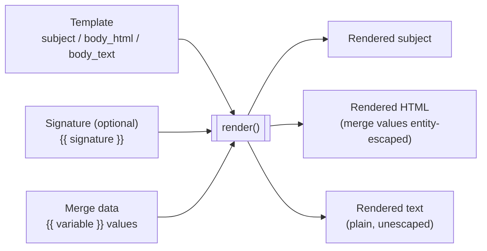

# PRD — Mail Template Definition & Management

**Document Version:** 1.0.0  
**Status:** Approved Design  
**Author:** CEGAANA Architecture Group  
**Target Package:** `simple-mailer` (`@cegaana/simple-mailer`)

---

## 1. Overview & Objectives

The **Mail Template Subsystem** manages reusable, multi-format (HTML and plain text) message templates within the standalone Mailer Engine. It decouples message presentation and dynamic variable rendering from campaign orchestration and CRM business logic.

### Core Goals
1. **Separation of Content & Logic:** External callers configure campaigns by referencing template IDs (`template_id` or `template_slug`), rather than embedding raw HTML strings inside campaign definitions.
2. **Dual-Format Rendering:** Every template supports both rich HTML and fallback plain-text formats.
3. **Modular Signatures:** Native support for reusable email signatures (e.g. CEGAANA Admins, Event Organizing Team, Chapter President) that can be appended dynamically or embedded via placeholder.
4. **Safe Variable Interpolation:** Strict placeholder interpolation (`{{first_name}}`, `{{tier_title}}`) with fallback defaults and automatic HTML entity escaping.
5. **Headless & Programmatic First:** Template creation, editing, preview, and validation are driven via TypeScript API and CLI (Visual Template Builder UI in Admin Portal is deferred).

---

## 2. Template Data Model (`_mailer_templates`)

Templates are stored in the isolated `_mailer_templates` table inside SQLite:

| Column Name | Type | Constraints | Description |
| :--- | :--- | :--- | :--- |
| **`id`** | `TEXT` | `PRIMARY KEY` | Unique UUID or semantic slug (e.g. `tpl_speaker_briefing_2026`). |
| **`slug`** | `TEXT` | `UNIQUE NOT NULL` | Human-readable identifier (e.g. `event-registration-receipt`). |
| **`name`** | `TEXT` | `NOT NULL` | Display name (e.g. `Conference 2026 Registration Receipt`). |
| **`description`** | `TEXT` | `NULL` | Purpose and usage guidelines. |
| **`subject`** | `TEXT` | `NOT NULL` | Subject template with optional variables (e.g. `Welcome {{first_name}} to Conference!`). |
| **`body_html`** | `TEXT` | `NOT NULL` | HTML template body with merge placeholders. |
| **`body_text`** | `TEXT` | `NOT NULL` | Plain-text fallback body. |
| **`signature_id`** | `TEXT` | `NULL` | Optional default signature reference. |
| **`sample_data_json`**| `TEXT` | `NULL` | Default sample JSON for preview and rendering tests. |
| **`created_at`** | `TEXT` | `NOT NULL` | ISO 8601 creation timestamp. |
| **`updated_at`** | `TEXT` | `NOT NULL` | ISO 8601 update timestamp. |

---

## 3. Modular Signatures (`_mailer_signatures`)

To ensure consistent branding and sender representation across different campaigns, signatures are managed as independent entities:

| Column Name | Type | Description |
| :--- | :--- | :--- |
| **`id`** | `TEXT` | Unique ID / semantic slug (e.g. `sig_exec_committee`). |
| **`name`** | `TEXT` | Label (e.g. `CEGAANA Board 2026`). |
| **`signature_html`**| `TEXT` | HTML markup (logos, social links, footer disclaimers). |
| **`signature_text`**| `TEXT` | Plain text ASCII signature block. |

### Signature Integration
- In templates, the placeholder `{{ signature }}` automatically expands to the resolved signature content.
- If a campaign specifies a `signature_id`, it overrides the template default.

---

## 4. Interpolation & Formatting Rules

### 4.1 Syntax Rules
- **Basic Interpolation:** `{{ variable_name }}` (whitespace inside braces is trimmed).
- **Default Fallbacks:** `{{ variable_name | default('Friend') }}` or `{{ company | default('Your Company') }}`.
- **Nested Properties:** `{{ contact.profile.linkedin }}`.
- **Built-in System Variables:**
  - `{{ system.current_year }}` $\rightarrow$ `2026`
  - `{{ system.unsubscribe_url }}` $\rightarrow$ Cryptographically signed unsubscribe link.
  - `{{ system.campaign_name }}` $\rightarrow$ Campaign display title.

### 4.2 HTML Escaping & Security
- All user-supplied merge data interpolated into `body_html` is automatically sanitized and HTML-entity-escaped (`&`, `<`, `>`, `"`, `'`).
- Safe HTML blocks (such as generated buttons or trusted signatures) use three braces: `{{{ raw_html_block }}}`.
- `body_text` preserves clean, unescaped plain text without HTML tags.

### 4.3 Rendering Pipeline



---

## 5. Template Engine TypeScript API

```ts
export interface RenderTemplateOptions {
    templateIdOrSlug: string;
    mergeData: Record<string, any>;
    signatureId?: string;
    strictMode?: boolean; // If true, throws on missing required variables
}

export interface RenderedMessage {
    subject: string;
    html: string;
    text: string;
}

export class TemplateManager {
    constructor(private dbProvider: MailerDataProvider) {}

    async createTemplate(template: NewTemplateInput): Promise<string>;
    async updateTemplate(id: string, updates: Partial<NewTemplateInput>): Promise<void>;
    async getTemplate(idOrSlug: string): Promise<MailerTemplate | null>;
    async listTemplates(): Promise<MailerTemplate[]>;

    async createSignature(sig: NewSignatureInput): Promise<string>;
    async listSignatures(): Promise<MailerSignature[]>;

    async render(options: RenderTemplateOptions): Promise<RenderedMessage>;
    async validateTemplate(bodyHtml: string, bodyText: string): Promise<{ valid: boolean; variables: string[]; errors?: string[] }>;
}
```

---

## 6. CLI Template Commands

```bash
# List all registered templates
simple-mailer template list

# Create a new template from local files
simple-mailer template create \
  --slug "event-speaker-invite" \
  --name "Event Speaker Invitation" \
  --subject "Invitation to Speak at Conference 2026, {{ first_name }}" \
  --html ./templates/speaker-invite.html \
  --text ./templates/speaker-invite.txt \
  --signature "sig_exec_committee"

# Preview a rendered template with mock or sample data
simple-mailer template preview event-speaker-invite \
  --data '{"first_name": "Jane", "grad_year": 1988, "role": "Keynote Speaker"}'

# Test-render and validate template syntax
simple-mailer template validate ./templates/speaker-invite.html
```

---

## 7. Deferred Items & Future Roadmap

- **WYSIWYG / Visual Template Builder UI:** Visual drag-and-drop template editor inside `tools/admin` (v2 roadmap).
- **Template Versioning & Rollback:** Keeping an immutable historical log of template revisions (`_mailer_template_versions`).
- **A/B Testing Variants:** Associating multiple template variations with a single campaign to measure open/click rates.
