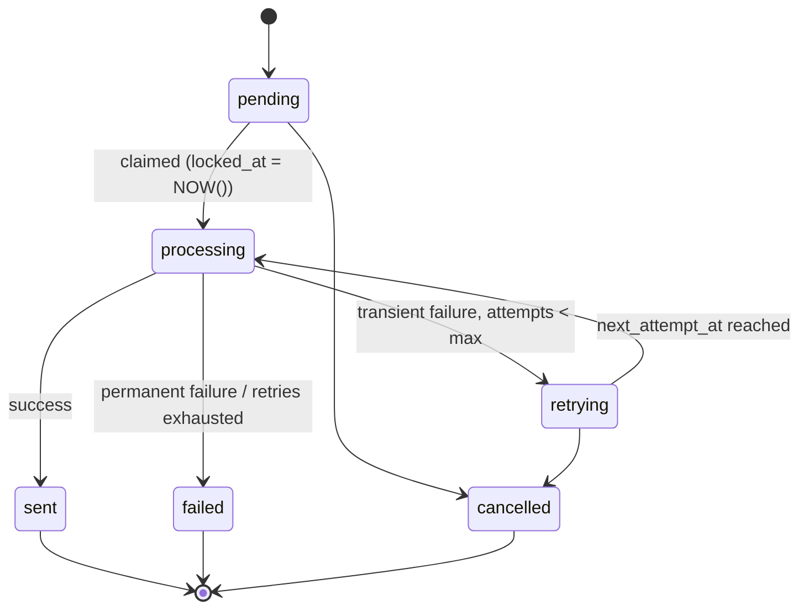

# PRD — Standalone Mailer Subsystem

**Document Version:** 2.0.0  
**Status:** Approved Design  
**Author:** CEGAANA Architecture Group  
**Target Package:** `simple-mailer` (`@cegaana/simple-mailer`)

---

## 1. Executive Summary & Tech Stack

The **Mailer Engine Subsystem** is an isolated, embeddable queue dispatcher for executing bulk campaigns and transactional emails with rate pacing, exponential backoff, and robust error handling.

### Technology Stack
- **Runtime & Language:** Node.js $\ge 22.0.0$ (ESM), TypeScript 5.8+.
- **Mail Transport Engine:** Nodemailer with Google Workspace Gmail API / OAuth2 transport and local Mock transport.
- **Database Storage:** `better-sqlite3` (with storage abstracted behind a `MailerDataProvider` interface).
- **Environment & Secrets:** `dotenv` (in-memory OAuth2 client secrets and refresh tokens).

---

## 2. Isolated Schema Management

The mailer engine automatically initializes and manages its own internal tables on startup. It **never modifies, adds columns to, or depends upon** existing CRM database tables.

👉 **Canonical SQL DDL Schema:** [`mailer-schema.sql`](../simple-mailer/schema/mailer-schema.sql)

All mailer tables are explicitly prefixed with `_mailer_`:

| Table Name | Primary Key | Purpose | Key Constraints & Indexes |
| :--- | :--- | :--- | :--- |
| **`_mailer_campaigns`** | `id` (`TEXT`) | First-class campaign entity storing subject, templates, status (`draft`, `scheduled`, `running`, `paused`, `completed`, `cancelled`), and timestamps. | Index on `status` |
| **`_mailer_templates`** | `id` (`TEXT`) | Multi-format message templates (subject, HTML, plain text, default signature, sample data JSON). | `slug` (`UNIQUE`) |
| **`_mailer_signatures`**| `id` (`TEXT`) | Reusable organizational/sender email signatures (HTML + text format). | `name` (`TEXT`) |
| **`_mailer_queue`** | `id` (`TEXT`) | Individual recipient delivery jobs, state machine columns (`status`, `attempts`, `locked_at`, `next_attempt_at`), and merge tags JSON. | `UNIQUE(campaign_id, email)`, compound index on `(status, next_attempt_at)`, index on `email` |
| **`_mailer_suppression`** | `email` (`TEXT`) | Global opt-out, hard-bounce, and manual unsubscribe registry. | Fast lookup primary key |
| **`_mailer_logs`** | `id` (`TEXT`) | Granular dispatch audit log recording provider message IDs, delivery latency, and error strings. | Index on `(campaign_id, created_at)` |

---

## 3. Core Module API: `MailerEngine` Class

The primary programmatic interface is the `MailerEngine` class:

```ts
import Database from 'better-sqlite3';

export interface MailerAuthOptions {
    userEmail: string;       // e.g. "events@cegaana.org"
    clientId: string;
    clientSecret: string;
    refreshToken: string;
    accessToken?: string;
}

export interface MailerDefaults {
    delayMs?: number;        // Default: 2500ms between sends
    maxRetries?: number;     // Default: 2 retries (3 attempts total)
    batchLimit?: number;     // Default: 1000 jobs per run
    leaseTimeoutSec?: number;// Default: 60s lock timeout
}

export interface RecipientInput {
    id?: string;             // Optional loose CRM ID
    email: string;
    name?: string;
    metadata?: Record<string, any>;
}

export interface DispatchOptions {
    limit?: number;
    delayMs?: number;
    dryRun?: boolean;        // If true, uses MockTransport without real sending
    onProgress?: (progress: JobProgress) => void;
}

export interface JobProgress {
    jobId: string;
    email: string;
    status: 'sent' | 'retrying' | 'failed';
    completedCount: number;
    totalCount: number;
    percent: number;
    errorMessage?: string;
}

export interface DispatchReport {
    campaignId: string;
    status: 'completed' | 'paused' | 'aborted';
    totalProcessed: number;
    sentCount: number;
    retriedCount: number;
    failedCount: number;
    durationMs: number;
    abortReason?: string;
}

export interface CampaignStats {
    campaignId: string;
    campaignName: string;
    status: string;
    totalQueued: number;
    sentCount: number;
    retryingCount: number;
    failedCount: number;
    pendingCount: number;
    successRate: string;
}

export class MailerEngine {
    constructor(
        db: Database.Database,
        auth?: MailerAuthOptions,
        defaults?: MailerDefaults
    );

    // Campaign Lifecycle
    createCampaign(
        name: string,
        subject: string,
        templates: { text: string; html: string },
        templateId?: string
    ): Promise<string>;

    getCampaignStats(campaignId: string): Promise<CampaignStats>;
    listCampaigns(): Promise<Array<{ id: string; name: string; status: string; total: number }>>;
    updateCampaignStatus(campaignId: string, status: 'scheduled' | 'running' | 'paused' | 'cancelled'): Promise<void>;

    // Queue Operations
    enqueueRecipients(
        campaignId: string,
        recipients: RecipientInput[]
    ): Promise<{ queuedCount: number; duplicateCount: number; suppressedCount: number }>;

    // Dispatch & Execution
    dispatch(
        campaignId: string,
        options?: DispatchOptions
    ): Promise<DispatchReport>;

    // Suppression Management
    addSuppression(email: string, reason: string): Promise<void>;
    isSuppressed(email: string): Promise<boolean>;
    listSuppressions(): Promise<Array<{ email: string; reason: string; created_at: string }>>;
}
```

---

## 4. Execution, Pacing & Rate Limit Abort Handling

### 4.1 Rate Pacing
- **Enforced Delay:** The dispatcher introduces a sleep of `delayMs` (default: **2,500ms**) between consecutive sends.
- **Quota Safety:** 2,500ms pacing restricts throughput to 24 emails/minute, safely below Google Workspace sending limits (which allow up to 100 recipients per transaction / 2,000 per day).

### 4.2 Abort & Quota Handling
When Google Workspace API returns rate-limiting or quota errors:
- **HTTP 429 / HTTP 550 / `UserRateLimitExceeded`:**
  - The dispatcher updates the current job to `retrying` with an extended backoff (5 minutes).
  - The dispatcher immediately **aborts the active `dispatch()` run**, updates the campaign status to `paused`, and returns `DispatchReport` with `status: 'aborted'` and `abortReason: 'Google API rate limit encountered'`.
  - Upstream callers / workers can alert operators or reschedule dispatch after the cooldown period.

### 4.3 Atomic State Transitions
Every queue job transitions state atomically:
1. `pending` / `retrying` $\rightarrow$ `processing` (with `locked_at = NOW()`).
2. On Success: $\rightarrow$ `sent` (`sent_at = NOW()`, `provider_message_id = '...'`).
3. On Transient Failure (attempts < max): $\rightarrow$ `retrying` (`next_attempt_at = NOW() + backoff`).
4. On Permanent Failure / Exhausted Retries: $\rightarrow$ `failed` (`error_message = '...'`).



---

## 5. Local Mock Testing Subsystem

To enable 100% offline verification and CI testing without credentials:
- **`MockTransport`:** Intercepts all outbound messages, validates MIME multipart structure, checks dynamic merge variables, and saves payloads to in-memory buffers and `.data/mock_mailer_sinks/`.
- **Ethereal / Web Preview Integration:** Generates local preview URLs for visual HTML email verification.
- **Fault Injection:** Configurable modes (`flakyMode`, `failSpecificEmail`) to test retry and abort handlers.

---

## 6. CLI Command Suite

```bash
# Campaign Management
simple-mailer campaign create --name "Speaker Briefing" --subject "Conference 2026 Details" --html ./body.html --text ./body.txt
simple-mailer campaign enqueue <campaign-id> --csv ./recipients.csv
simple-mailer campaign stats <campaign-id>

# Dispatch & Pacing
simple-mailer dispatch <campaign-id> --dry-run
simple-mailer dispatch <campaign-id> --delay 2500 --limit 50

# Suppression & Opt-Outs
simple-mailer suppression add test@example.com --reason "manual"
simple-mailer suppression list
```

---

## 7. Verification & Test Plan

Tests live in each package's own `tests/` directory in this repo —
`simple-mailer/tests/` for the library, `cmailer/tests/` for the CLI:

| Test Suite | File Path | Invariant Tested |
| :--- | :--- | :--- |
| **Queue & Enqueue** | `simple-mailer/tests/provider.test.ts` | Snapshot copying, deduplication per campaign, suppression filtering. |
| **State Transitions** | `simple-mailer/tests/claim.test.ts` | Atomic state changes (`pending` $\rightarrow$ `processing` $\rightarrow$ `sent`/`retrying`/`failed`). |
| **Paced Dispatch** | `simple-mailer/tests/engine.test.ts` | 2,500ms delay pacing, `MockTransport` capture, and progress callbacks. |
| **Rate Limit Abort** | `simple-mailer/tests/engine.test.ts` | Safe dispatch abort on simulated HTTP 429/550 errors. |
| **Crash Recovery** | `simple-mailer/tests/engine.test.ts` | Expired leases automatically reclaimed from `processing` to `retrying`. |

See [`status-and-usage.md`](./status-and-usage.md) for the complete, current
test inventory across both packages.
